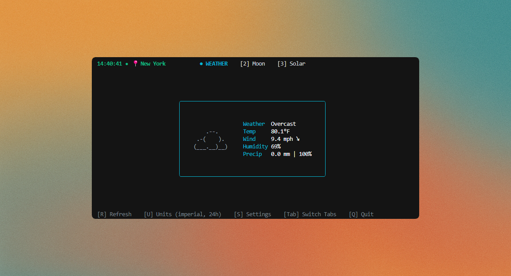
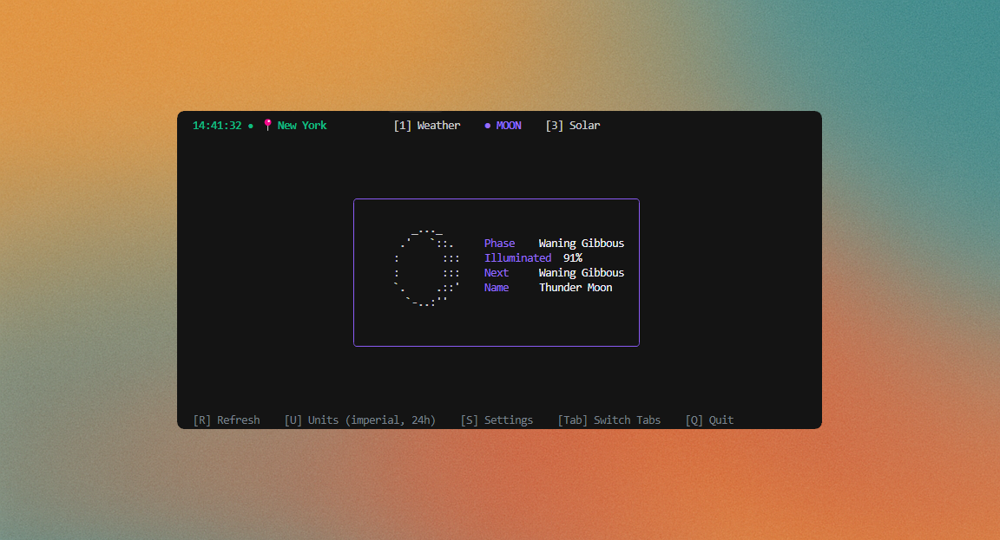
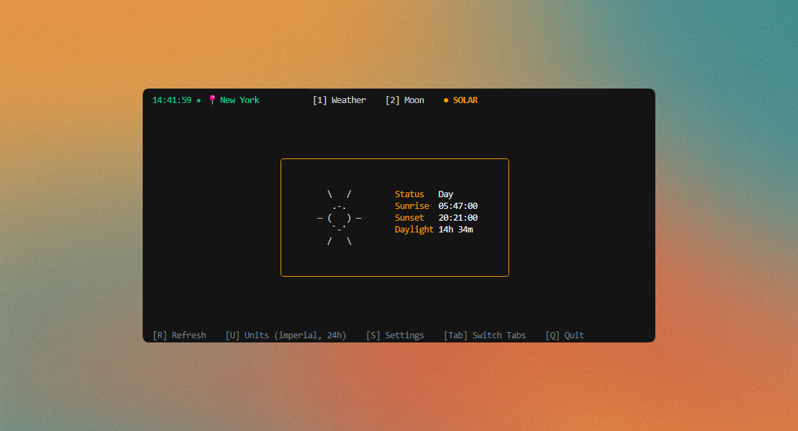

# WMS - Weather, Moon, & Solar / Weather Management System.

A comprehensive, terminal-based weather dashboard, WMS provides detailed weather, moon phase, and solar information in a clean, elegant, and highly configurable TUI (Text-based User Interface).

<p align="center">
  
  
  
</p>

## Features

- **Tabbed Interface**: Switch between three distinct views:
    - **Weather**: A detailed, Stormy-style weather display with ASCII art icons.
    - **Moon**: Information about the current moon phase, illumination, and next phase.
    - **Solar**: Sunrise, sunset, and daylight duration information.
- **In-App API Key Management**: Set and save your API key directly from the settings menu with secure storage.
- **Responsive UI**: Dynamic scaling that adapts to any terminal size with centered, readable content.
- **Paste Support**: Easy configuration with paste support for API keys and locations.
- **Secure Storage**: API keys stored in `~/.config/wms/.env` with owner-only permissions (0600).
- **Dynamic ASCII Art**: Weather icons change based on the conditions, and the solar tab shows a sun during the day and a moon at night.
- **Highly Configurable**: Customize units, time format, and more using a simple TOML configuration file or command-line flags.
- **Automatic Location Detection**: If no location is specified, WMS will attempt to determine your location automatically based on your IP address.
- **Real-time Updates**: Weather and time information updates automatically with configurable refresh intervals.

## Installation

### Option 1: Download Pre-built Binary (Recommended)

1. **Download the latest release** for your platform from the [Releases page](https://github.com/Traves-Theberge/WMS/releases/latest):
   - `WMS_Linux_x86_64.tar.gz` (Most Linux systems)
   - `WMS_Linux_arm64.tar.gz` (ARM Linux like Raspberry Pi)
   - `WMS_Darwin_x86_64.tar.gz` (Intel Mac)
   - `WMS_Darwin_arm64.tar.gz` (M1/M2/M3 Mac)
   - `WMS_Windows_x86_64.tar.gz` (Windows)

2. **Extract and run**:
   ```bash
   tar -xzf WMS_Linux_x86_64.tar.gz
   cd WMS_Linux_x86_64
   ./wms
   ```

3. **Set up your API key** (on first run):
   - Press `S` to open Settings
   - Navigate to "Set API Key" (arrow down)
   - Press Enter and paste your key from [WeatherAPI.com](https://www.weatherapi.com/signup.aspx)
   - Press Enter to save
   - The app will automatically test the connection!

### Option 2: Build from Source

1.  **Clone the repository**:
    ```bash
    git clone https://github.com/Traves-Theberge/WMS.git
    cd WMS
    ```

2.  **Build the application**:
    ```bash
    go build -o wms ./cmd/wms
    ```

3. **Run and configure**:
   ```bash
   ./wms
   # Press 'S' for Settings to add your API key
   ```

## Quick Start

1. **Run WMS**:
   ```bash
   ./wms
   ```

2. **First time setup** (if no API key is configured):
   - Press `S` to open Settings
   - Select "Set API Key" and press Enter
   - Get a free API key from [WeatherAPI.com](https://www.weatherapi.com/signup.aspx)
   - Paste your API key (Ctrl+Shift+V)
   - Press Enter to save - connection will be tested automatically!

3. **Navigate**:
   - Press `1`, `2`, `3` to switch between Weather/Moon/Solar tabs
   - Press `U` to cycle through unit/time combinations
   - Press `R` to refresh data
   - Press `Q` to quit

### Command-Line Flags

You can override the default configuration using command-line flags:

| Flag          | Description                  | Default |
|---------------|------------------------------|---------|
| `-location`   | Location to get weather for  | ""      |
| `-units`      | Units (metric, imperial)     | "metric"|
| `-time`       | Time format (12, 24)         | "24"    |
| `-compact`    | Compact display mode         | false   |
| `-refresh`    | Refresh interval in minutes  | 5       |
| `-help`       | Show help                    | false   |

**Example**:

```bash
./wms -location "New York" -units "imperial"
```

## Configuration

WMS stores configuration in two files:

### API Key Storage (Secure)

**Recommended**: Use the in-app settings menu (press `S`) to set your API key. It will be securely stored at:
- **Linux/macOS**: `~/.config/wms/.env`
- **Windows**: `%APPDATA%\wms\.env`

The file is created with `0600` permissions (owner read/write only) for security.

**Manual setup** (optional):
```bash
# Linux/macOS
echo "WEATHER_API_KEY=your_key_here" > ~/.config/wms/.env
chmod 600 ~/.config/wms/.env

# Or use the .env.example as a template
cp .env.example ~/.config/wms/.env
# Edit with your key
```

### General Settings (`wms.toml`)

Located at:
- **Linux/macOS**: `~/.config/wms/wms.toml`
- **Windows**: `%APPDATA%\wms\wms.toml`

The application creates a default configuration on first run:

```toml
# Weather settings
weather_provider = "WeatherAPI"
location = ""              # Empty = IP-based detection
location_mode = "ip"       # "ip" or "manual"

# Display settings
units = "metric"           # "metric" or "imperial"
time_format = "24"         # "12" or "24"
use_colors = true
compact = false
show_city_name = true

# Update settings
refresh_interval = 5       # minutes (1-60)
```

**Settings Menu**: Press `S` in the app to configure location mode, set location, manage API key, and save settings.

## Keyboard Shortcuts

### Main Navigation
| Key           | Action                                      |
|---------------|---------------------------------------------|
| `1`           | Switch to Weather Tab                       |
| `2`           | Switch to Moon Tab                          |
| `3`           | Switch to Solar Tab                         |
| `Tab`         | Cycle through tabs (forward)                |
| `Shift+Tab`   | Cycle through tabs (backward)               |
| `Q`           | Quit the application                        |

### Data & Settings
| Key      | Action                                           |
|----------|--------------------------------------------------|
| `R`      | Refresh all data                                 |
| `U`      | Cycle units/time (Metric 24h → Metric 12h → Imperial 24h → Imperial 12h) |
| `T`      | Toggle time format only (12h ↔ 24h)              |
| `S`      | Open settings menu                               |

### Settings Menu
| Key           | Action                            |
|---------------|-----------------------------------|
| `↑` / `↓`     | Navigate options                  |
| `Enter`       | Select option                     |
| `Esc`         | Cancel and return to weather view |

### Input Fields (API Key, Location)
| Key                    | Action                       |
|------------------------|------------------------------|
| `Enter`                | Save and apply               |
| `Esc`                  | Cancel without saving        |
| `Backspace`/`Ctrl+H`   | Delete character             |
| `Ctrl+U`               | Clear entire line            |
| `Ctrl+Shift+V`         | Paste (or right-click)       |

## Inspiration

WMS draws inspiration from several fantastic open-source projects. A special thanks to the creators and maintainers of:

- **[chubin/wttr.in](https://github.com/chubin/wttr.in)**: The original console-based weather service that set the standard for terminal weather reports.
- **[dpr-1/stormy](https://github.com/dpr-1/stormy)**: Another excellent Go-based weather tool that provided valuable insights and ideas.
- **[liveslol/rainy](https://github.com/liveslol/rainy)**: A beautiful terminal-based weather application that inspired the UI design.

## Dependencies
- [bubbletea](https://github.com/charmbracelet/bubbletea)
- [lipgloss](https://github.com/charmbracelet/lipgloss)
- [toml](https://github.com/BurntSushi/toml)
- [godotenv](https://github.com/joho/godotenv) 

## Issues and Contributing

### Reporting Issues

If you encounter any bugs or have feature requests, please open an issue on GitHub:

1. Check if the issue already exists in the [Issues](https://github.com/your-username/wms/issues) section
2. If not, create a new issue with:
   - A clear and descriptive title
   - Steps to reproduce the problem
   - Expected vs actual behavior
   - Your system information (OS, terminal, etc.)
   - Configuration file contents (if relevant)

### Pull Requests

Contributions are welcome! To submit a pull request:

1. Fork the repository
2. Create a feature branch (`git checkout -b feature/amazing-feature`)
3. Make your changes
4. Test your changes thoroughly
5. Commit your changes (`git commit -m 'Add some amazing feature'`)
6. Push to the branch (`git push origin feature/amazing-feature`)
7. Open a Pull Request

Please ensure your PR:
- Follows the existing code style
- Includes appropriate tests if applicable
- Updates documentation as needed
- Has a clear description of the changes

## License 

This project is licensed under the terms of the `LICENSE` file.